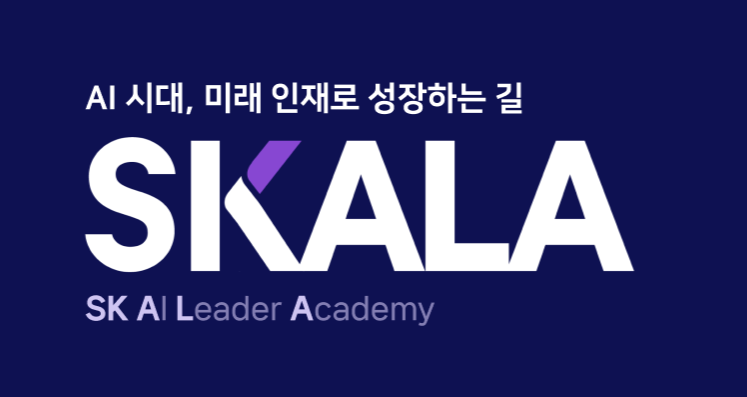

# SKALA 4th



<br>

<p>
  
  
  
  
  
  
  
</p>

SK AI Leader Academy **SKALA 4기** 교육 과정에서 진행한 실습·과제 코드를 모아두는 기록용 저장소입니다.
<br/>
분야별(AI, Backend, Cloud, Frontend, ML, Git)로 폴더를 나누어 정리했습니다.

## 📁 디렉토리 구조

```
SKALA-4th/
├── AI/
│   ├── llm-transformer-agent/     # LLM·Transformer·Agent 실습 (진행 예정)
│   └── sllm-fine-tuning/          # sLLM 실행/비교 및 LoRA SFT 파인튜닝 실습 노트북
│
├── backend/springboot/
│   ├── StockTrading/               # day2 - JPA 기반 주식 거래 API (Repository/Service/Controller)
│   ├── StockTrading2/              # day3 - CRUD 8종 + 포트폴리오 분석 API 5종
│   └── shopapi/                    # SKALA 굿즈 쇼핑몰 REST API (JWT 인증, Swagger, H2)
│
├── cloud/docker-container/
│   └── board/                      # Docker Compose로 구성한 게시판 (Nginx Web + Flask WAS)
│
├── frontend/
│   ├── html-css-js/todo-list/      # 바닐라 JS로 구현한 Todo 리스트
│   └── skala-vue/                  # Vue 3 + Vite 실습 프로젝트
│
├── github/
│   └── git-profile-lab/            # Git/GitHub 기본 사용법 실습 (커밋, 브랜치, 원격 저장소)
│
└── ML/
    └── day1-async-data-pipeline/   # asyncio 기반 데이터 파이프라인 실습
```

## 🗂️ 프로젝트별 요약

카드마다 배지 3개(가능한 경우) · 설명 한 줄로 형식을 맞췄습니다.

### Git

<table width="100%">
<tr>
<td valign="top" width="960">

**`git-profile-lab`**
<br/>


<br/>
Git/GitHub 기본기 실습

</td>
</tr>
</table>

### Frontend

<table width="100%">
<tr>
<td valign="top" width="480">

**`todo-list`**
<br/>


<br/>
바닐라 JS Todo 리스트

</td>
<td valign="top" width="480">

**`skala-vue`**
<br/>


<br/>
Vue 3 + Pinia SPA 실습

</td>
</tr>
</table>

### Backend

<table width="100%">
<tr>
<td valign="top" width="480">

**`StockTrading` / `StockTrading2`**
<br/>


<br/>
JPA 기반 주식 거래 API

</td>
<td valign="top" width="480">

**`shopapi`**
<br/>


<br/>
MyBatis 굿즈 쇼핑몰 API

</td>
</tr>
</table>

### ML

<table width="100%">
<tr>
<td valign="top" width="960">

**`day1-async-data-pipeline`**
<br/>


<br/>
asyncio 비동기 데이터 파이프라인

</td>
</tr>
</table>

### AI

<table width="100%">
<tr>
<td valign="top" width="480">

**`sllm-fine-tuning`**
<br/>


<br/>
sLLM 비교 + LoRA 파인튜닝

</td>
<td valign="top" width="480">

**`llm-transformer-agent`**
<br/>

<br/>
LLM·Agent 실습 (예정)

</td>
</tr>
</table>

### Cloud

<table width="100%">
<tr>
<td valign="top" width="960">

**`docker-container/board`**
<br/>


<br/>
Nginx + Flask 분리형 게시판

</td>
</tr>
</table>

---

> 각 프로젝트별 실행 방법과 상세 내용은 하위 폴더의 README를 참고하세요.
